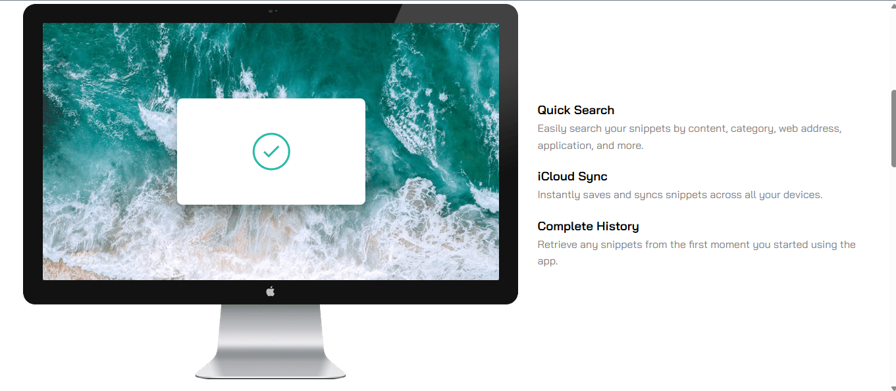

# Clipboard Landing Page

This is my solution to the **Clipboard Landing Page Challenge** from Frontend Mentor. The goal of this project was to build a fully responsive landing page based on a provided design.

---

##  Screenshot

---

##  Links

- Solution URL: https://github.com/Bitingingwa
- Live Site URL:https://freedev-group.github.io/jonathan-clipboard-landing-page

---

##  Built With

- Semantic HTML5 markup
- CSS3
- Flexbox
- CSS Grid
- Responsive design principles
- Google Fonts (Bai Jamjuree)

---

##  Overview

This project consists of a modern landing page for a fictional app called Clipboard. It includes multiple sections such as:

- Hero section
- Features section
- Access section
- Tools section
- Company logos
- Call-to-action section
- Footer with navigation and social icons

The layout was built to match the provided design as closely as possible across different screen sizes.

---

##  What I Learned

Through this project, I improved my skills in:

- Structuring a complete multi-section landing page
- Using Flexbox and CSS Grid for layout design
- Implementing responsive design techniques
- Paying attention to UI details such as spacing, alignment, and typography
- Working with custom fonts like Bai Jamjuree

---

##  Challenges I Faced

Some challenges I encountered included:

- Aligning elements properly, especially in the footer
- Managing layout structure across different sections
- Fixing small CSS and HTML inconsistencies (class naming, structure)
- Matching the design accurately

I overcame these by debugging my code, checking class names carefully, and adjusting layout properties like flexbox and grid.

---

##  Continued Development

In future projects, I would like to:

- Improve my responsive design skills further
- Write more scalable and organized CSS
- Focus more on accessibility best practices
- Explore animations and interactive UI improvements

---

##  Acknowledgments

Special thanks to Mentor Samuel and the FreeDev Community for their guidance, support, and encouragement throughout this project.

---

##  Author

- GitHub – https://github.com/Bitingingwa
- Frontend Mentor – https://www.frontendmentor.io/profile/Bitingingwa